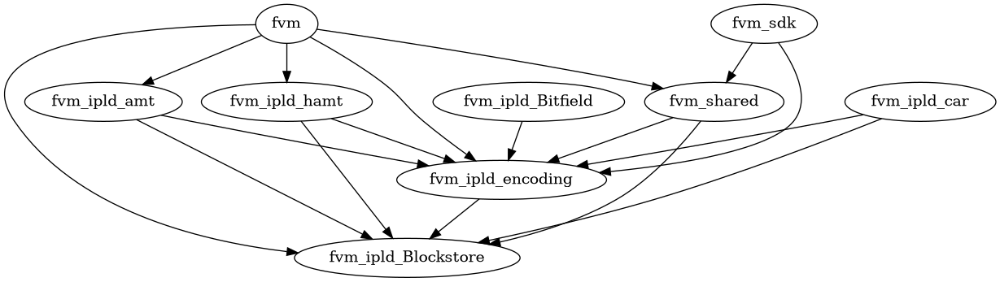

# Contributing

This document describes the process of contributing to the reference FVM implementation (this project).

## Issues

If you have a general FVM related question or idea, please either as on the [Filecoin Slack][chat], or open
a new discussion in [fvm-specs][discuss].

If you'd like to report a _bug_ or suggest an enhancement in the reference FVM implementation, please file [an issue][issue].

## Pull Requests

To make a change to the FVM.

1. When in doubt, open an [issue][] first to discuss the change.
2. Make your change.
3. Write a test for your change.
4. Update the crate's `CHANGELOG.md`. If you're making any breaking changes, prefix change with
   "BREAKING:".
5. Finally, open a PR.

## Releasing

The primary crates, `fvm`, `fvm_shared`, `fvm_sdk`, and `fvm_integration_tests`, are versioned and
released together. Other crates in the workspace are versioned and released independently.

Currently version numbering is not strictly semver compatible. Breaking changes may be included in
minor releases while major releases are reserved for dropping old network versions.

All changes should be well tested. See [builtin actors testing][builtin actors testing].

### Primary FVM crates

To propose a new release, open a pull request with the following changes:

1. Update the version in `Cargo.toml`: `workspace.package→version`.
2. Update the version of the coupled workspace dependencies in `Cargo.toml` to match the new version
   (leaving semver range specifier `~` intact):
   1. `wokspace.package→fvm→version`
   2. `wokspace.package→fvm_shared→version`
   3. `wokspace.package→fvm_sdk→version`
   4. `wokspace.package→fvm_integration_tests→version`
3. Update the lockfile with a rebuild: `cargo build`.
4. Make sure the `CHANGELOG.md` files in each of `fvm`, `sdk`, and `shared` are all up-to-date (look
   through `git log -- path/to/crate`), set the release date & version, and add a new "Unreleased"
   section. It may be appropriate to duplicate some entries across these crates if the changes are
   relevant to multiple crates.

### Other crates

To propose a release of a crate other than `fvm`, `fvm_shared`, `fvm_sdk`, or
`fvm_integration_tests`, open a pull request with the following changes:

1. Install `cargo-edit` (`cargo install cargo-edit`).
2. Use `cargo set-version` to set the version for each crate you're releasing. This will both
   update the crate version, and make all other crates in the workspace depend on the latest version.
3. Make sure the `CHANGELOG.md` files are all up-to-date (look through `git log -- path/to/crate`),
   set the release date & version, and add a new "Unreleased" section.

### Review and Release

Once the release is prepared, it'll go through a review:

1. Make sure that we're _ready_ to release. E.g., make sure downstream can consume the release.
2. Make sure that we're correctly following semver.
3. Make sure that we're not missing anything in the changelogs.

Finally, an [FVM "owner"](https://github.com/orgs/filecoin-project/teams/fvm-crate-owners/members) will:

1. Merge the release PR to master.
2. For each released crate, create a git: `crate_name@crate_version`.
3. Run `cargo publish` for each released crate (in dependency order).

### Crate Dependency Graph

The crates in this workspace have the following structure:



### Builtin-Actors Testing

If you're releasing any non-trivial changes to crates used by the builtin actors, please test them. This includes:

- Any crates in `ipld/` except `car`.
- `shared/` (`fvm_shared`).
- `sdk/` (`fvm_sdk`).

To test:

1. Checkout this repo as `ref-fvm/` and and the builtin-actors repo as `builtin-actors/` in the same directory.
2. Uncomment the "patch" section in `builtin-actors/Cargo.toml` that starts with:
    ```toml
    [patch.crates-io]
    fvm_shared = { path = "../ref-fvm/shared" }
    ...
    ```
3. Run `cargo test --all` (or, at a minimum, `cargo check --all --tests --lib`.

If that works, proceed with releasing these crates.

[chat]: https://docs.filecoin.io/about-filecoin/chat-and-discussion-forums/#chat
[discuss]: https://github.com/filecoin-project/fvm-specs/discussions
[issue]: https://github.com/filecoin-project/ref-fvm/issues
